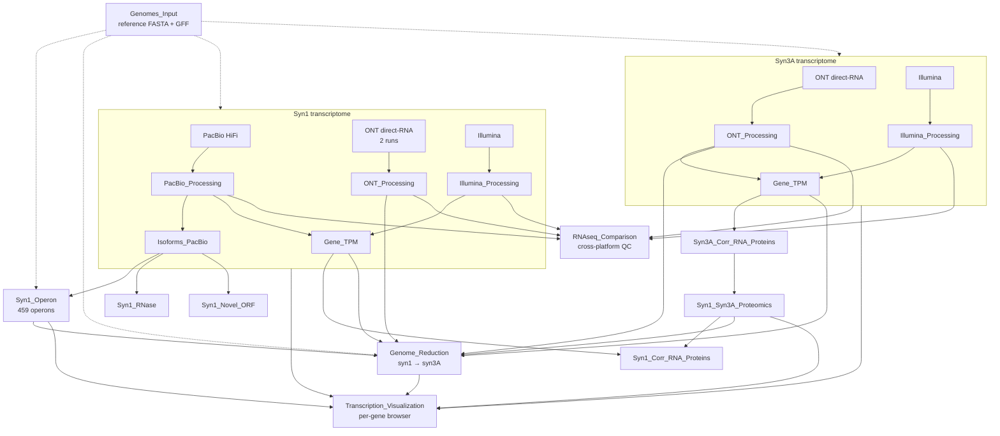

# Full-length transcriptomics and proteomics of synthetic minimal cells

Analysis code accompanying the manuscript:

> **Full-length transcriptomics and proteomics reveal how genome minimization reshapes gene expression in synthetic bacteria**

We combine full-length long-read RNA sequencing (PacBio Iso-Seq and Oxford Nanopore direct-RNA for **JCVI-syn1.0**, Oxford Nanopore direct-RNA for **JCVI-syn3A**), short-read Illumina quantification, and matched proteomics to build a genome-wide, operon-resolved map of transcription, RNA processing, and translation for both synthetic cells, and to compare how halving the genome reshapes that map.

This repository holds the complete pipeline, from raw-read retrieval to the figures and Supplementary Data of the paper.

---

## Repository structure

```
.
├── Genomes_Input/            reference genomes (FASTA + GFF) for both organisms
│
├── Syn1_Transcriptomics/     syn1 PacBio + ONT (2 runs) + Illumina: read processing, isoforms, per-gene TPM
├── Syn3A_Transcriptomics/    syn3A ONT + Illumina: read processing, isoforms, per-gene TPM
├── RNAseq_Comparison/        cross-platform / cross-run TPM and read-length comparison
│
├── Syn1_Operon/              syn1 operon segmentation, annotation, and visualization (459 operons)
│
├── Syn1_Syn3A_Proteomics/    proteomics tables (relative iPM + absolute copy numbers) for both
├── Syn1_Corr_RNA_Proteins/   syn1 transcriptome × proteome correlation and residual analysis; protein copy number quantification
├── Syn3A_Corr_RNA_Proteins/  syn3A transcriptome × proteome correlation; protein copy number quantification
├── Syn1_RNase/               RNA-processing / ribonuclease analysis (3' erosion)
├── Syn1_Novel_ORF/           novel-ORF / antisense / intergenic transcription discovery
│
├── Genome_Reduction/         syn1 → syn3A comparison (deletions, operon remodeling, expression)
│
├── Transcription_Visualization/  per-gene browser: every RNA-seq library over any gene, both organisms
│
└── env/                      conda environment specification
```

A detailed, file-level map of every script and its outputs lives in [`CLAUDE.md`](CLAUDE.md); output conventions are in [`OUTPUT.md`](OUTPUT.md).

---

## Environment

All analysis runs in a single conda environment (Python 3.10):

```bash
conda env create -f env/RNAseq.yml
conda activate RNAseq
```

It bundles the Python scientific stack (NumPy, pandas, SciPy, Matplotlib, Biopython, pysam) and the main bioinformatics tools: **minimap2** 2.30, **bowtie2** 2.5.5, **samtools** 1.23, **BLAST+** 2.17, and **ViennaRNA** 2.6.4. Two tools are installed separately — **SRA-Toolkit** (read download) and **TransTermHP** (terminator prediction) — see [`env/extra_softwares.txt`](env/extra_softwares.txt).

---

## Workflow

Data flows from raw reads (left/top) through per-organism processing and into the cross-organism comparison:



The syn1 ONT libraries are two independent direct-RNA runs that are **kept separate throughout** — they differ in rRNA-depletion chemistry and agree only moderately (Pearson *r* = 0.82 on log₁₀ TPM), so they are never averaged. The merged BAM is retained only as a genome-browser track and as the isoform source for the syn1 ONT panels.

### Run order

Run the stages in this order; each folder's scripts read the outputs of the stages above it.

1. **Retrieve raw reads** — bash scripts in the `*_Raw/` folders download FASTQs from the NCBI SRA (`*_Transcriptomics/{PacBio,Illumina,ONT}/*_Raw/`).
2. **Process reads** — the `*_Processing/` folders map reads (minimap2 for long reads, bowtie2 for Illumina), sort/index with samtools, and emit per-strand depth bedGraphs. The syn1 ONT folder processes both runs separately (`syn1.ONT.rep{1,2}.sorted.bam`) plus a merged browser track; run 2 is sequenced 3′→5′ and is reoriented during mapping.
3. **Cluster isoforms** — `Isoforms_PacBio/` (syn1) and `Isoform_Cluster/` (syn3A) collapse full-length PacBio reads into isoform clusters.
4. **Per-gene TPM** — `Gene_TPM/` computes sense/antisense TPM per gene from the depth tracks.
5. **Cross-platform comparison** — `RNAseq_Comparison/` computes per-gene TPM for every library (syn1 PacBio / Illumina / ONT run 1 / ONT run 2, syn3A ONT / Illumina) and builds the read-length and platform-agreement panels.
6. **Proteome** — `Syn1_Syn3A_Proteomics/` builds the per-protein relative (iPM) and absolute abundance tables.
7. **Operons** — `Syn1_Operon/` segments and annotates operons from the isoforms, with promoter and terminator signatures.
8. **Per-organism analyses** — `Syn1_Corr_RNA_Proteins/` (RNA↔protein correlation), `Syn3A_Corr_RNA_Proteins/` (absolute RNA copies per cell, fed into the proteome browser), `Syn1_RNase/` (RNA processing + ribonuclease cleavage-site mapping), `Syn1_Novel_ORF/` (antisense / intergenic / novel ORFs).
9. **Genome reduction** — `Genome_Reduction/` runs scripts `01`→`10` in numeric order to recast the syn1→syn3A deletions as operon junctions and quantify the transcriptome/proteome reallocation. Run with `Genome_Reduction/` as the working directory.
10. **Browse any gene** — `Transcription_Visualization/` draws every library over a region of your choosing (see below). Nothing downstream depends on it, so run it whenever you want to look at a gene.

> Most Python scripts carry their full method, parameters, and a result summary in a header docstring, and write a companion `.txt` log next to their outputs.

---

## Browsing transcription at any gene

To look at one gene rather than a genome-wide table, **navigate to [`Transcription_Visualization/`](Transcription_Visualization/)** and open [`Transcription_Visualization.ipynb`](Transcription_Visualization/Transcription_Visualization.ipynb):

```python
import transcription_viz as tv

tv.check_inputs()                       # confirms every upstream file this needs is reachable
fig, txt, R = tv.plot_region("ptsG")    # or "0779", "MMSYN1_0779", "JCVISYN3A_0779"
tv.show(R)
```

One call stacks **every RNA-seq library over that region in a single figure** — syn1 PacBio, ONT run 1, ONT run 2 and Illumina; syn3A ONT and Illumina — each as a read stack over its own depth track, above gene arrows for both organisms. The window, anchor, gene lists, operon bracket, TSS and terminator marks, and the red *absent from Syn3A* deletion bands are all derived from the pipeline tables, so a gene name is the only input. Every call writes a PDF, a PNG and a `_stats.txt` (per-gene depth, read counts, protein copies per cell, promoter −10 scan, predicted terminators) into `Transcription_Visualization/regions/`.

It reads the depth bedGraphs and BAMs from steps 2–3, the operon map from step 7, the proteomics tables from step 6, and the deletion map from step 9 — so run those first. Options and conventions are documented in [`Transcription_Visualization/README.md`](Transcription_Visualization/README.md).

---

## Key outputs (Supplementary Data)

| | File | Built by |
|---|---|---|
| **S1** | `operon.xlsx` — per-operon table (boundaries, signals, complexes) | `Syn1_Operon/build_operon_xlsx.py` |
| **S2** | `syn1_omics.xlsx` — paired transcriptome + proteome for 911 syn1 genes | `Syn1_Corr_RNA_Proteins/` |
| **S3** | `genome_reduction.xlsx` — deletions, junctions, per-gene expression change | `Genome_Reduction/` |
| **S4** | `Supplementary_Data_S4_QC.zip` — RNA-sample QC reports | `build_S4_qc.py` |

---

## Data availability

Raw sequencing data are deposited in the NCBI SRA under **BioProject [PRJNA1359397](https://www.ncbi.nlm.nih.gov/bioproject/PRJNA1359397)** (syn1 Illumina + PacBio + ONT, syn3A ONT). The syn3A Illumina data are from Sandberg *et al.* (2023). Reference genomes: **CP002027.1** (JCVI-syn1.0) and **CP016816.2** (JCVI-syn3A). Mass-spectrometry proteomics are on the MassIVE repository under **MSV000099558**.

---

## Citation

If you use this code or data, please cite the manuscript above. (Full citation details will be added upon publication.)
